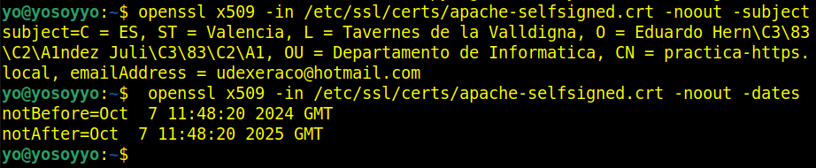
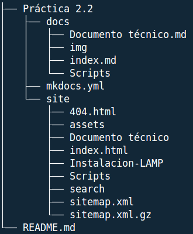

# Apache Práctica 2. Certificado SSL/TLS

## **PASO 1**

### Instalación del conjunto de sofware LAMP

Un script de instalación de LAMP automatiza la instalación y configuración de los componentes esenciales de la pila LAMP (Linux, Apache, MySQL, PHP) en un sistema Linux, evitando que tengas que ejecutar manualmente cada comando.
Este script realiza todas las acciones necesarias, como la actualización del sistema, la instalación de paquetes, la configuración de servicios.

** Puedes ver el script [aquí](Scripts/Instalacion-LAMP.sh)

<a href="Scripts/Instalacion-LAMP.sh" download>**DESCARGAR**</a>

Lo comprobamos con las versiones:

## **PASO 2**

### Automatizamos la creación de un certificado autofirmado mediante un script

Un certificado autofirmado nos permite cifrar la comunicación entre el cliente y el servidor, lo cual es crucial para proteger datos sensibles, especialmente en entornos de desarrollo y pruebas.
Automatizar el proceso de creación ahorra tiempo y esfuerzo. Al ejecutar un script, se pueden generar los archivos necesarios sin tener que realizar cada paso manualmente.

** Puedes ver el script [aquí](Scripts/setup-certificado-firmado.sh)

<a href="Scripts/setup-certificado-firmado.sh" download>**DESCARGAR**</a>

Lo comprobamos:
- Consultando la información del sujeto del cetificado y la fecha de caducidad

## **PASO 3**

### Configuramos un VirtualHost con SSL/TSL en el servidor Apache mediante un script combinado que nos crea las dos configuraciones.

En nuestro caso , utilizaremos el script que nos creará un fichero xxx-ssl.conf en: `/etc/apache2/sites-available/xxx-ssl.conf `  

Nos habilitará el virtual host que acabamos de configurar y el módulo SSL en Apache.

  
### Configuramos el virtual host de HTTP para que redirija todo el tráfico a HTTPS con el mismo script

En nuestro caso, el virtual host que maneja las peticiones HTTP está en el archivo de configuración que utiliza Apache por defecto para el puerto 80  y el mismo script nos creará un fichero:

`/etc/apache2/sites-available/xxxx.conf. ` 

El script nos habilitará el módulo rewrite en apache y reinicirá el servicio.

** Puedes ver el script [aquí](Scripts/ssl-conf_.conf.sh)

<a href="Scripts/ssl-conf_.conf.sh" download>**DESCARGAR**</a>

Comprobamos los sitios creados en `/etc/apache/sites-available `

Vemos los contenidos que nos ha creado el script automáticamente.

Comprobamos los sitios creados en `/etc/apache/sites-enable `

Vemos el contenido que nos ha creado el script automáticamente.

## **PASO 4**

### Reiniciamos el servicio lo comprobamos y verificamos los puertos que tenemos abiertos en las reglas de nuestro firewall.

Borramos el index.html por default y creamos uno personalizado para hacer las pruebas.

Comprobamos después de volver a reiniciar Apache que podemos acceder a ella desde un navegador web.

## **ESQUEMA DE LA ESTRUCTURA DEL REPOSITORIO**

