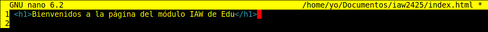
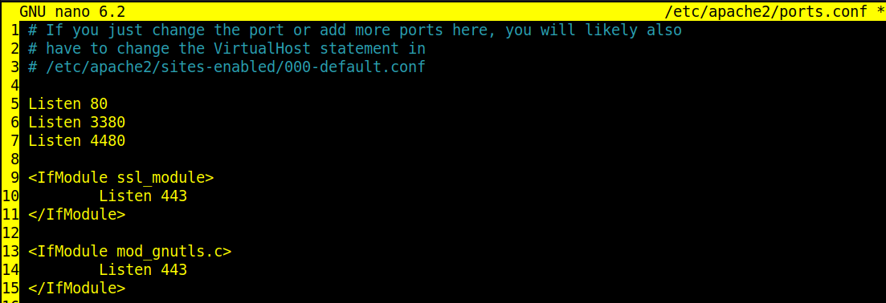
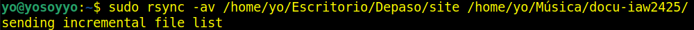
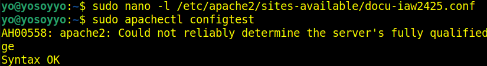
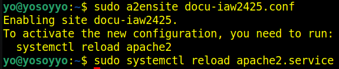
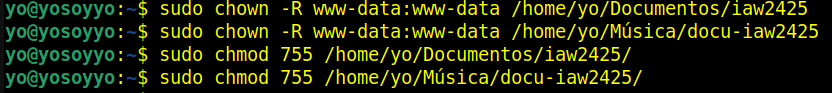
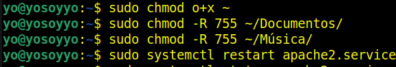

     <h1>Práctica 2.1</h1>

---

    <h2>Implantación de una web estática con Apache</h2>

---

Vamos construir en nuestro servidor web apache dos sitios web con las siguientes características:

* El nombre de dominio del primero será `www.iaw2425.org`, su directorio base será /`home/yo/Documentos/iaw2424` y contendrá una página llamada `index.html`, donde sólo se verá una bienvenida a la página del módulo IAW.
Este sitio lo configuraremos para acceder a el desde el `puerto 3380`
* En el segundo sitio vamos a crear una página donde se pondrá la documentación del módulo, el nombre de este sitio será `www.docu-iaw2425.org`, y su directorio base será `/home/yo/Música/docu-iaw2425/site/`. En esta página se pondrá la documentación del módulo IAW generada con mkdocs.
Copiaremos sólo el contenido del directorio site de la documentación generada, ya que es contenido estático..
Este sitio lo configuraremos para acceder a él desde el `puerto 4480`

---

### 1.- Creamos los dos directorios de los sitios

### 2.- Copiamos el fichero por defecto 000-default.conf para dos sitios virtuales

---

### 3.- Configuramos el sitio apache para el primer lugar

### 4.- Verificamos la sintaxis

### 5.- Creamos el contenido de la página de bienvenida del primer sitio

### Configuramos apache para escuchar por los puertos `3380` para el primer sitio y `4480` para el segundo sitio

### 7.- Habilitamos y recargamos el primer sitio apache

### 8.- Creamos el contenido de la página de bienvenida del segundo sitio

`Copiamos la carpeta site desde la ubicación donde la tenemos a ~/Música/docu-iaw2425`

---

### 9.- Configuramos el sitio apache para el segundo lugar

### 10.- Verificamos la sintaxis

### 11.- Habilitamos y recargamos el segundo sitio apache

### 12.- Agregamos estas líneas en el archivo /etc/hosts para las pruebas

### 13.- Asignar los permisos correctos para el usuario www-data

### 14.- Permisos adicionales

Al estar fuera del directorio `/var/www` en mi caso debo ajustar los permisos para que apache pueda acceder a ellos, por lo que daré además permisos a los directorios que apache necesita atravesar, por que sino me da error de permisos:

### 15.- Abrimos el navegador y verificamos que los sitios funcionen

---

Para el primer sitio: <http://www.iaw2425.org:3380>

---

---

Para el segundo sitio: <http://www.docu-iaw2425.org:4480>

---
