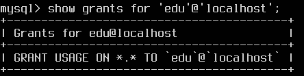
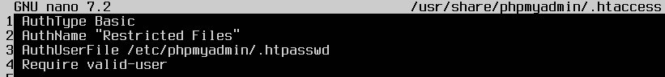
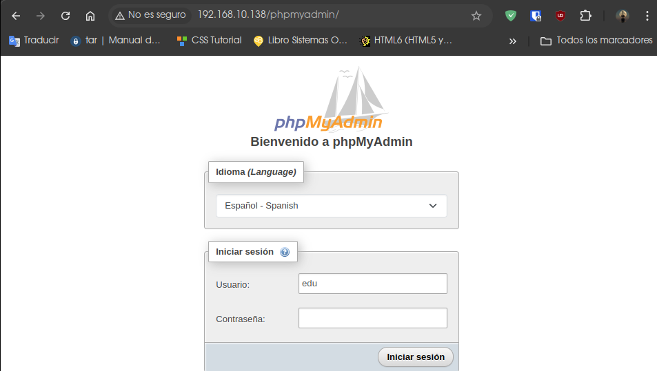

# PHP Práctica 2.3: Instalar, configurar y securizar phpMyAdmin

## **PASO 1**

### Instalación del conjunto de sofware LAMP

Un script de instalación de LAMP automatiza la instalación y configuración de los componentes esenciales de la pila LAMP (Linux, Apache, MySQL, PHP) en un sistema Linux, evitando que tengas que ejecutar manualmente cada comando.
Este script realiza todas las acciones necesarias, como la actualización del sistema, la instalación de paquetes, la configuración de servicios.

** Puedes ver el script [aquí](Instalacion-LAMP.md)

[Descargar el archivo](./scripts/Instalacion-LAMP.sh)

Lo comprobamos con las versiones:

Comprobamos el estado de apache y ajustamos la configuración del firewall:

Comprobamos en el navegador que también nos funciona:

Ahora vamos a ver la página web predeterminada de PHP:
Creamos un archivo con el nombre veo.php

`echo "<?php
phpinfo();" | sudo tee /var/www/html/veo.php`

Para probarlo nos vamos a muestro navegador web y accedemos al nombre de dominio o dirección IP de nuestro servidor, seguido del nombre del script, que en nuestro caso es `veo.php`:

## **PASO 2**

### Automatizamos la instalación y configuración de PhpMyAdmin mediante un script

Automatizar la instalación y configuración de PhpMyAdmin mediante un script proporciona eficiencia, consistencia, seguridad y escalabilidad, lo que es extremadamente útil para administradores de sistemas y equipos de desarrollo que gestionan múltiples entornos o despliegues frecuentes.

### En este script nos realiza las siguientes tareas automáticamente

- **Nos instala phpMyAdmin**
    1-  Instala phpMyAdmin junto con las extensiones PHP necesarias `(php-mbstring,   php-zip, php-gd, php-json, php-curl).`

    2- Configura phpMyAdmin para que funcione con Apache.

    

    

    3- Habilita la extensión `mbstring` y reinicia Apache.

- **Nos configura automáticamente el acceso por contraseña para la cuenta root de MySQL**
  
    1- Cambia el método de autenticación del usuario root de MySQL de auth_socket a `caching_sha2_password.`

- **Nos configura también el acceso por contraseña para un usuario dedicado de MySQL**
  
    1- Crea un `nuevo usuario de MySQL` con una contraseña segura.

    

    2- Otorga al nuevo usuario los `privilegios` apropiados para gestionar las bases de datos a través de phpMyAdmin.

    

- **Nos asegurando nuestra Instancia de phpMyAdmin**
  
    1- Habilita el uso de sobrescrituras de archivos `.htaccess` en la configuración de Apache para phpMyAdmin.

    

    2- Crea un archivo `.htaccess` en el directorio de phpMyAdmin para implementar autenticación básica.

    

    3- Crea un archivo .`htpasswd` para almacenar las credenciales de usuario y contraseña.

    

    4- Reinicia Apache para aplicar los cambios.

** Puedes ver el script [aquí](phpmyadmin-script.md)

[Descargar el archivo](./scripts/phpmyadmin-script.sh)

Vemos el primer control de acceso para phpMyAdmin

Ahora el segundo y habitual

Finalmente estamos dentro para gestionar nuestras BBDD

