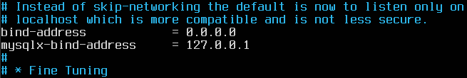
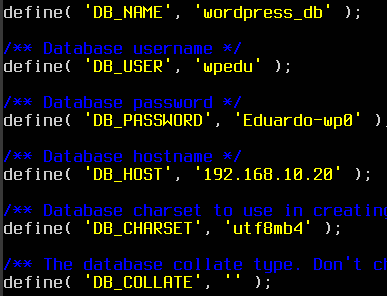
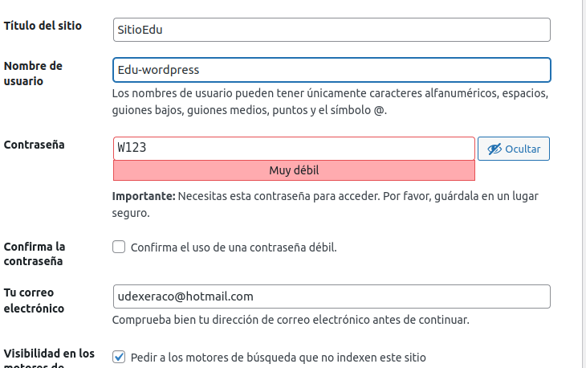

# Práctica 2.4 Instalar y configurar Wordpress

## PASO 1: Configurar el Servidor 2 (Mysql)

### Actualizar el sistema e instalar Mysql.

`sudo apt update && sudo apt upgrade -y`

### Instalar Mysql.

`sudo apt install mysql-server`

### Acceder a Mysql como administrador root.

`sudo mysql -u root`

### Crear la BBDD

`CREATE DATABASE wordpress_db;`

`CREATE USER 'wp_user'@'%' IDENTIFIED BY 'tu_contraseña_segura';`

`GRANT ALL PRIVILEGES ON wordpress_db.* TO 'wp_user'@'%';`

`FLUSH PRIVILEGES;`

`EXIT;`


### Permitiremos las conexiones remotas

`sudo nano /etc/mysql/mysql.conf.d/mysqld.cnf`

Buscaremos la línea que contiene `bind-address` y la cambiaremos de `127.0.0.1` a `0.0.0.0` para permitir conexiones desde cualquier dirección IP.



### Reiniciaremos Mysql

`sudo systemctl restart mysql`

### Abriremos el puerto Mysql (3306) en el firewall

`sudo ufw allow 3306`


De esta forma, con un script descargamos mysql y el servidor queda listo para soportar una instalación de WordPress, con acceso remoto a la BBDD si es necesario.

**Puedes ver el script** [aquí](Mysql-para-wordpress.md)

[Descargar el archivo](./scripts/Mysql-para-wordpress.sh)


## PASO 2: Instalar Apache, PHP, las extensiones necesarias y descargar e instalar Wordpress

### Instalamos Apache que será el servidor web donde se alojará Wordpress.

`sudo apt install apache2 -y`

#### Instalamos PHP y las extensiones necesarias.

`sudo apt update`

`sudo apt install apache2 ghostscript libapache2-mod-php`

`sudo apt install php php-bcmath php-curl php-imagick php-intl`

`sudo apt install php-json php-mbstring php-mysql php-xml php-zip`

### Reiniciamos apache para que los cambios surtan efecto.

   `sudo systemctl restart apache2.service`

### Descargamos la última versión de WordPress y colocamos en la carpeta web de Apache.

`cd /tmp`

`wget https://wordpress.org/latest.tar.gz`

`tar -xzf latest.tar.gz`

`sudo mv wordpress /var/www/html/`

### Cambiamos la propiedad y permisos de los archivos.

`sudo chown -R www-data:www-data /var/www/html/wordpress`

`sudo chmod -R 755 /var/www/html/wordpress`

### Configurar WordPress para conectarse a la base de datos.

`cd /var/www/html/wordpress`

### Copiamos el archivo de configuración.

`cp wp-config-sample.php wp-config.php`

### Editamos el archivo de configuración de WordPress.

`sudo nano wp-config.php`

### Cambiamos las siguientes líneas para apuntar al "Servidor 2" (MySQL) en lugar de usar "localhost".

`define('DB_NAME', 'wordpress_db');     // Nombre de la base de datos`

`define('DB_USER', 'wp_user');          // Usuario de la base de datos`

`define('DB_PASSWORD', 'tu_contraseña_segura'); // Contraseña del usuario`

`define('DB_HOST', 'IP_DEL_SERVIDOR_2'); // La IP del Servidor 2 (donde está MySQL)`



### Configuramos Apache para WordPress creando un archivo de configuración para el sitio de WordPress en Apache.

`sudo nano /etc/apache2/sites-available/wordpress.conf`

### Agregamos lo siguiente:

```bash
<VirtualHost *:80>
    DocumentRoot /srv/www/wordpress
    <Directory /srv/www/wordpress>
        Options FollowSymLinks
        AllowOverride Limit Options FileInfo
        DirectoryIndex index.php
        Require all granted
    </Directory>
    <Directory /srv/www/wordpress/wp-content>
        Options FollowSymLinks
        Require all granted
    </Directory>
</VirtualHost>
```


### Luego habilitamos el nuevo sitio de WordPress y el módulo de reescritura de Apache:

`sudo a2ensite wordpress.conf`
`sudo a2enmod rewrite`

### Deshabilitamos el sitio predeterminado “It Works” con:

`sudo a2dissite 000-default`

### Reiniciamos Apache para aplicar los cambios:

`sudo systemctl restart apache2`

## Paso 3: Finalizamos la instalación de WordPress

### Abrimos el navegador: Nos dirigimos a la dirección IP del "Servidor 1" en un navegador (`http://IP_DEL_SERVIDOR_1`)





De esta forma con un script:

1. **Automatizamos la instalación** de Apache, PHP y WordPress.
2. **Configuramos una arquitectura distribuida** con la base de datos en un servidor separado, mejorando rendimiento y seguridad.
3. **Optimizamos los recursos** al permitir un mejor uso de la CPU y memoria en cada servidor.

** Puedes ver el script [aquí](Apache-wordpress-php.md)

[Descargar el archivo](./scripts/Apache-wordpress-php.sh)

