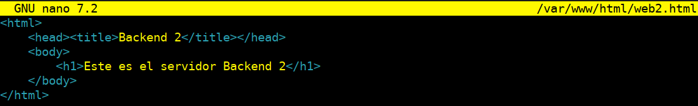
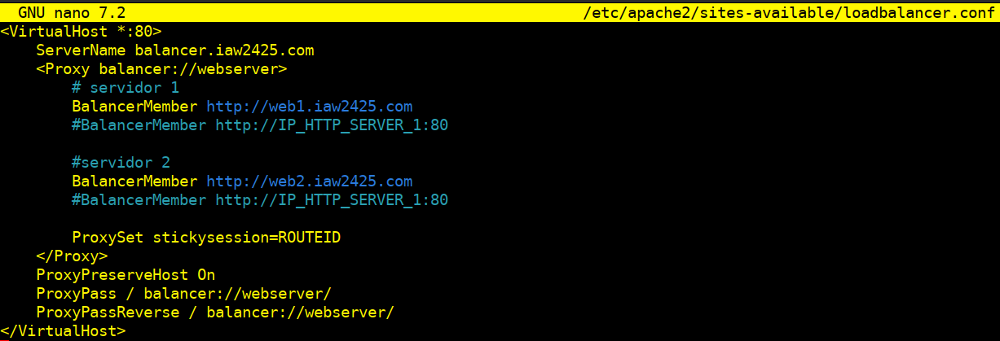

<div style="text-align: center;">
     <h1>Práctica 2.5</h1>
</div>

---

<h1>Práctica 2.5 - Balanceo de Carga con Apache</h1>

## Actualizar Paquetes del Sistema

**Primero, actualizaremos y mejoraremos todos los paquetes del sistema a la última versión en todos los servidores:**

`apt update -y`

`apt upgrade -y`

Reiniciaremos todos los servidores para aplicar los cambios.

## Instalaremos el Servidor Web Apache en los tres servidores

`sudo apt install apache2 -y`

Verificamos el estado del servicio Apache:

`systemctl status apache2`


## Configuramos el Primer Servidor Backend Apache

### Configuramos el Firewall

#### Establecemos los puertos 22 y 80 para comunicarnos por terminal con el servidor y para poder acceder al servidor apache

`sudo ufw enable`

`sudo ufw allow 22`

`sudo ufw allow 80`


#### Eliminamos la página por defecto (DocumentRoot) `index.html` para evitar que no interfiera en cada servidor backend `web1` y `web2`

`cd /var/www/html`

`sudo rm -rf index.html`

#### Creamos una página HTML de muestra y un archivo de configuración de host virtual en el primer servidor Apache

`sudo nano /var/www/html/web1.html`

**Agregamos el siguiente código HTML:**

```html
<html>
    <head><title>Backend 1</title></head>
    <body>
        <h1>Este es el servidor Backend 1</h1>
    </body>
</html>
```


**Guardamos y cerramos el archivo.**

#### Deshabilitamos el sitio por defecto de Apache para evitar conflictos

`cd /etc/apache2/sites-available`

`sudo a2dissite 000-default.conf`

`sudo systemctl reload apache2.service`

#### Creamos el archivo de configuración del host virtual

`nano /etc/apache2/sites-available/web1.conf`

Agregamos las siguientes configuraciones:

```apache
<VirtualHost *:80>
    ServerName web1.iaw2425.com
    ServerAdmin webmaster@localhost
    DocumentRoot /var/www/html
    DirectoryIndex web1.html
    ErrorLog ${APACHE_LOG_DIR}/error.log
    CustomLog ${APACHE_LOG_DIR}/access.log combined
</VirtualHost>
```


**Guardamos y cerramos el archivo, luego habilitamos y recargamos el servicio Apache:**
Habilitamos:

`sudo a2ensite web1.conf`

`sudo systemctl reload apache2`


## Configuramos el Segundo Servidor Backend Apache

### A partir de la configuración del Firewall realizaremos los dos mismos pasos previos hechos anteriormente hasta aquí, que es donde cambiaremos la configuración para el segundo servidor

#### Creamos una página HTML de muestra en el segundo servidor

`sudo nano /var/www/html/web2.html`

**Agregamos el siguiente código HTML:**

```html
<html>
    <head><title>Backend 2</title></head>
    <body>
        <h1>Este es el servidor Backend 2</h1>
    </body>
</html>

```



**Deshabilitamos el sitio por defecto de Apache para evitar conflictos**

`cd /etc/apache2/sites-available`

`sudo a2dissite 000-default.conf`

`sudo systemctl reload apache2.service`

**Guardamos y cerramos el archivo.**

**Creamos el archivo de configuración del host virtual**

`nano /etc/apache2/sites-available/web2.conf`

Agregamos las siguientes configuraciones:

```apache
<VirtualHost *:80>
    ServerName web2.iaw2425.com
    ServerAdmin webmaster@localhost
    DocumentRoot /var/www/html
    DirectoryIndex web2.html
    ErrorLog ${APACHE_LOG_DIR}/error.log
    CustomLog ${APACHE_LOG_DIR}/access.log combined
</VirtualHost>
```


**Guardamos y cerramos el archivo, luego habilitamos y recargamos el servicio Apache:**
Habilitamos:

`sudo a2ensite web2.conf`

`sudo systemctl reload apache2`

## Creamos el Balanceador de Carga de Apache

### Una vez actualizado el sistema y configurado el Firewall seguiremos con los siguientes pasos

#### Habilitamos los módulos proxy en el servidor de balanceo de carga

```bash
a2enmod proxy
a2enmod proxy_http
a2enmod proxy_balancer
a2enmod lbmethod_byrequests
```

Reiniciamos el servicio Apache:

`sudo systemctl restart apache2`

Verifica todos los módulos proxy:

`sudo apachectl -M | grep proxy`

#### Creamos un archivo de configuración de Apache para el balanceo de carga

##### Deshabilitamos el sitio por defecto de Apache para evitar conflictos

`cd /etc/apache2/sites-available`

`sudo a2dissite 000-default.conf`

`sudo systemctl reload apache2.service`

**Creamos un archivo de configuración de Apache para el balanceo de carga**

`sudo nano /etc/apache2/sites-available/loadbalancer.conf`

Agregamos las siguientes configuraciones:

```apache
<VirtualHost *:80>
    ServerName balancer.iaw2425.com
    <Proxy balancer://webserver>
        # servidor 1
        BalancerMember http://web1.iaw2425.com
        #BalancerMember http://IP_HTTP_SERVER_1:80

        #servidor 2
        BalancerMember http://web2.iaw2425.com
        #BalancerMember http://IP_HTTP_SERVER_1:80

        ProxySet stickysession=ROUTEID
    </Proxy>
    ProxyPreserveHost On
    ProxyPass / balancer://webserver/
    ProxyPassReverse / balancer://webserver/
</VirtualHost>
```



**Guardamos y cerramos el archivo, luego habilitamos y recargamos el servicio Apache:**
Habilitamos:

`sudo a2ensite loadbalancer.conf`

`sudo systemctl reload apache2`

### Configuraremos la Política de Balanceo de Carga

**Para configurar la política de balanceo de carga es necesario tener activado previamente el módulo proxy_balancer con el siguiente comando:**

`sudo a2enmod proxy_balancer`

El balanceo de carga que vamos a utilizar en esta práctica será un balanceo de tipo Round Robin. Este método de balanceo de carga consiste en distribuir las peticiones entre los servidores de forma secuencial, de forma que cada vez que llegue una nueva petición se envía al siguiente servidor de la lista de servidores configurados en el servidor Apache.

**Para activar este método de balanceo tenemos que activar el módulo `lbmethod_byrequests:`**

`sudo a2enmod lbmethod_byrequests`

Este método de balanceo también permite distribuir las peticiones entre los servidores en función de los parámetros `lbfactor y lbstatus`.

Recordemos que después de habilitar los módulos es necesario reiniciar el servicio de Apache:

`systemctl restart apache2`

### Configuración en /etc/hosts

En el balanceador, agregaremos las IP y los nombres de todos los servidores backend (`web1, web2`) en el archivo **/etc/hosts**:

`# IP del servidor web1`

`<IP_web1> web1.iaw2425.com`

`IP del servidor web2`

`<IP_web2> web2.iaw2425.com`


### Pondremos en el navegador la IP del servidor balanceador para verificar el Balanceo de carga con Apache

Teniendo en cuenta también que tendremos que configurar antes en el fichero **/etc/hosts** del equipo donde tenemos el navegador la `IP del balanceador y nombre de dominio` para **asegurar que las solicitudes al dominio del balanceador se dirijan correctamente a la IP del balanceador**, en lugar de pasar por el DNS público o por algún otro servicio de resolución de nombres.


#### Tenemos que tener en cuenta el configurar la IP y el nombre del dominio en el balanceador en el fichero /etc/hosts , pero sino trabajamos con nombres de dominio solo con IP nos valdrá
