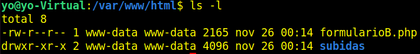

# Documentación Formularios

**Verificamos que tenemos instalado para la prueba Apache2 y php.**

`apache2 -v`

`php -v`

**Si no lo instalamos  y habilitamos con:**

`sudo apt update`

`sudo apt install php libapache2-mod-php`

`sudo a2enmod php`

`sudo systemctl restart apache2`

**Creamos un fichero .conf para nuestro sitio de pruebas.**

`sudo nano /etc/apache2/sites-available/formularios.conf`

**Habilitamos y recargamos.**

`sudo a2ensite formularios.conf`

`sudo systemctl reload apache2.service`

**Copiamos el archivo .php (que contiene la parte .html y la parte .php) en /var/www/html.**

** Puedes ver el fichero.php [aquí](FormularioB.md)

[Descargar el archivo](./FormularioB.php)

`sudo cp formularioB.php /var/www/html`

**Le damos permisos:**

`sudo chown -R www-data:www-data formularioB.php`

`sudo chmod -R 644 formularioB.php`

**Creamos en "/var/www/html" un directorio "subidas" para que contenga los ficheros que vamos a subir.**

El **nombre del directorio corresponde** con el que tenemos configurado en el **fichero.php**

`sudo mkdir /var/www/html/subidas`

**Le damos permisos:**

`sudo chown -R www-data:www-data subidas`

`sudo chmod -R 755 subidas`

**Comprobamos.**

## Documentación Técnica: Formulario de Subida de Archivos

### 1. Descripción del Formulario

Este formulario permite a los usuarios cargar un archivo de texto o una imagen desde su dispositivo al servidor. Posteriormente, el archivo se guarda en un directorio específico, y su contenido se muestra en la página según el tipo de archivo.

### 2. Campos que se Pueden Ingresar

- **Campo de Archivo:**
  - Etiqueta: `input type="file"`.
  - Atributo `name`: `fileToUpload`.
  - Atributo `accept`: `.txt, image/*` (solo archivos de texto-imagen JPG, PNG, GIF, etc.).
  - Es un campo obligatorio (`required`).

### 3. Validaciones que se realizan

#### En el Cliente (HTML)

- Solo se permiten archivos de texto (`.txt`) o imágenes (`image/*`).
- El campo es obligatorio (`required`).

#### En el Servidor (PHP)

1. **Tipo de Archivo:**
   - Se valida que el tipo de archivo esté en la lista permitida (`txt`, `jpg`, `jpeg`, `png`, `gif`).
   - Si no cumple, se muestra un mensaje de error y no se sube el archivo.
2. **Integridad de la Subida**:
   - Se verifica si hubo errores al subir el archivo (`$_FILES["archivoAsubir"]["error"]`).
3. **Seguridad**:
   - Se utiliza `basename()` y `htmlspecialchars()` para prevenir ataques de tipo *Path Traversal* o *Cross-Site Scripting (XSS)*.

### 4. Cómo se Envían los Datos

- **Método de Envío**: `POST`.
- **Encabezado**: `enctype="multipart/form-data"` para permitir la transferencia de datos binarios (archivos).

### 5. Cómo se Procesan los Datos

1. **Recepción**:
   - El archivo subido se recibe en la variable global `$_FILES["archivoAsubir"]`.
2. **Definición de Rutas**:
   - Se define un directorio de destino (`subidas/`) para almacenar los archivos subidos.
   - La ruta completa se forma concatenando el directorio de destino y el nombre del archivo (`basename()`).
3. **Validación del Tipo**:
   - El tipo de archivo se extrae usando `pathinfo()` y se compara con una lista permitida.
4. **Subida del Archivo**:
   - Si todas las validaciones son exitosas, el archivo se mueve al directorio especificado utilizando `move_uploaded_file()`.

### 6. Cómo se Muestra la Información en la Página

1. **Mensajes de Estado**:
   - Mensaje de éxito en verde si el archivo se subió correctamente.
   - Mensaje de error en rojo si no se subió debido a restricciones de tipo o problemas durante el proceso.
2. **Contenido del Archivo**:
   - Si es un archivo de texto (`.txt`), se lee su contenido con `file_get_contents()` y se muestra dentro de una etiqueta `<pre>` para conservar el formato.
   - Si es una imagen, se genera una etiqueta `` con la ruta del archivo subido como atributo `src`.

### 7. Cómo se Guarda el Archivo

- El archivo subido se guarda en el directorio `subidas/`.
- Si el directorio no existe, es necesario crearlo antes de realizar la subida.

### 8. Cómo se Muestra el Contenido del Archivo

1. **Archivos de Texto**:
   - Se lee el contenido del archivo usando `file_get_contents()`.
   - El contenido se escapa con `htmlspecialchars()` para evitar inyecciones de código.
2. **Imágenes**:
   - Se muestra una vista previa del archivo mediante una etiqueta `` con atributos `max-width` y `max-height` para limitar el tamaño.

---

### 9. Otra Información Relevante

- **Seguridad**:
  - La ruta del archivo se asegura con `basename()` para evitar rutas no deseadas.
  - `htmlspecialchars()` se utiliza para evitar que el nombre del archivo contenga caracteres que puedan romper el HTML.
- **Restricciones**:
  - Actualmente, no se validan los tamaños de archivo ni se manejan conflictos por nombres de archivos existentes. Es recomendable implementar estas verificaciones si se necesita una solución más robusta.
