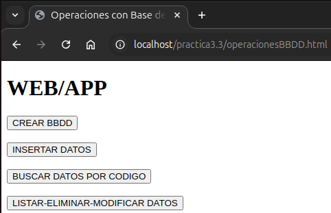
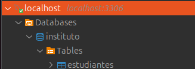
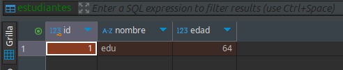
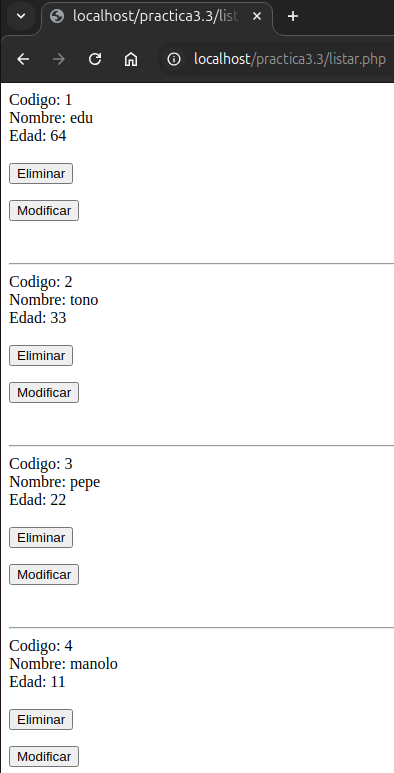
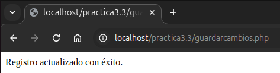

# Práctica 3.3 - Actividad Práctica de MySQL con Formularios en PHP

## 1.-Fichero para el menú en .html

** Podemos ver el fichero.html [aquí](operacionesBBDD.md)

[Descargar el archivo](operacionesBBDD.html.zip)

### 2.-Script para la creación la BBDD y tabla

**Crearemos la BBDD y la tabla.**

** Podemos ver el fichero.php [aquí](crearBBDD.md)

[Descargar el archivo](./crearBBDD.php)

### 3.-Formulario para insertar registros

**Creamos un formulario para que el usuario pueda agregar estudiantes.**

** Podemos ver el fichero.html [aquí](insertar-html.md)

[Descargar el archivo](./insertar.html)

### 4.-Script para manejar la inserción

**Este script recibe los datos del formulario y los inserta en la tabla.**

** Podemos ver el fichero.php [aquí](insertar-php.md)

[Descargar el archivo](./insertar.php)

### 5.-Formulario para buscar registros

**Creamos un formulario para buscar registros por código.**

** Podemos ver el fichero.html [aquí](buscar-html.md)

[Descargar el archivo](./buscar.html)

### 6.-Script para manejar la búsqueda

**Este script busca registros según el código ingresado.**

** Podemos ver el fichero.php [aquí](buscar-php.md)

[Descargar el archivo](./buscar.php)

### 7.-Formulario para listar registros y eliminarlos o modificarlos

**Creamos un formulario que redirige a un script para mostrar los registros y seleccionar si eliminarlo (delete) o modificarlo (update).**

** Podemos ver el fichero.html [aquí](listar-html.md)

[Descargar el archivo](./listar.html)

### 8.-Script para manejar el listado

**Este script recupera todos los registros de la tabla.**

** Podemos ver el fichero.php [aquí](listar-php.md)

[Descargar el archivo](./listar.php)

### 9.-Script para manejar la eliminación

**Este script elimina un registro de la tabla por ID.**

** Podemos ver el fichero.php [aquí](eliminar.md)

[Descargar el archivo](./eliminar.php)

### 10.-Script-formulario para manejar la modificación

**Este script lista un registro de la tabla por ID con sus datos para poder modificarlos.**

** Podemos ver el fichero.php formulario [aquí](modificar.md)

[Descargar el archivo](./modificar.php)

### 11.-Script para manejar la actualización (update)

** Podemos ver el fichero.php [aquí](guardarcambios.md)

[Descargar el archivo](./guardarcambios.php)

**Este script actualiza los datos del estudiante y guarda estos.**

