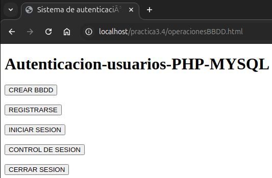
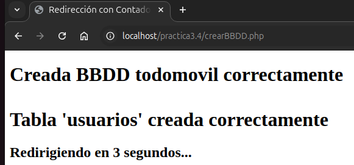
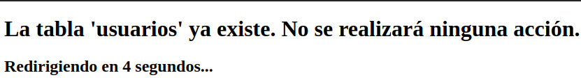
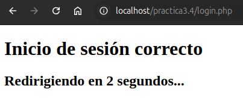

# 3.4. Proyecto 1 PHP

## Sistema de autenticación de usuarios en PHP y MYSQL

### 1.-Formulario .html para el menú

**Podemos ver el fichero.html [aquí](operacionesBBDD_html.md)**

**[Descargar el archivo](operacionesBBDD.html.zip)**

### 2.-Fichero script .php para la creación de la BBDD y tabla

**Podemos ver el fichero.php [aquí](crearBBDD_php.md)**

**[Descargar el archivo](crearBBDD.php)**

**Si intentamos volver a crear la tabla no se realizará nada.**

### 3.-Formulario para registrarse "insertar" registros

**Creamos un formulario para que el usuario se puede registrar.**

**Podemos ver el fichero.ccs [aquí](estilos_ccs.md)**

**[Descargar el archivo](estilos.ccs)**

**Podemos ver el fichero.html [aquí](registro_html.md)**

**[Descargar el archivo](registro.html.zip)**

### 4.-Fichero script .php para registrarse

**Podemos ver el fichero.php [aquí](insertar_php.md)**

**[Descargar el archivo](insertar.php)**

**Si "no coinciden" las contraseñas.**

**Si intentamos registrar un usuario con el "mismo correo".**

### 5.-Formulario para hacer "login"

**Podemos ver el fichero.ccs [aquí](inicio_css.md)**

**[Descargar el archivo](inicio.css.zip)**

**Podemos ver el fichero.html [aquí](login_html.md)**

**[Descargar el archivo](login.html.zip)**

### 6.-Fichero script .php para iniciar el login de sesión

**Podemos ver el fichero.php [aquí](login_php.md)**

**[Descargar el archivo](login.php)**

**Nos lleva a nuestra página protegida.**

### 7.-Fichero script .php "página protegida" con su imagen "logo"

**[Descargar el archivo de imagen](7883511.jpg)**

**Podemos ver el fichero.php [aquí](protegida_php.md)**

**[Descargar el archivo](protegida.php)**

**Al hacer click en "Ir a página de inicio" nos lleva a:**

**Si no ponemos correctamente uno de los dos datos de las credenciales, volvemos a la página formulario .html de login:**

### 8.-Fichero script .php para el control se sesión después del usuario del último login

**Podemos ver el fichero.php [aquí](control_sesion_php.md)**

**[Descargar el archivo](control_sesion.php)**

### 9.-Fichero script .php para "cerrar sesión" que nos redirige a la página de "Google"

**Podemos ver el fichero.php [aquí](logout_php.md)**

**[Descargar el archivo](logout.php)**

### 10.-Fichero script .php para la función de "conexión"

**Podemos ver el fichero.php [aquí](connection_php.md)**

**[Descargar el archivo](connection.php)**

### 11.-Fichero script .php para el tiempo de redirección

**Podemos ver el fichero.php [aquí](redirec_tiempo_php.md)**

**[Descargar el archivo](redirec_tiempo.php)**
