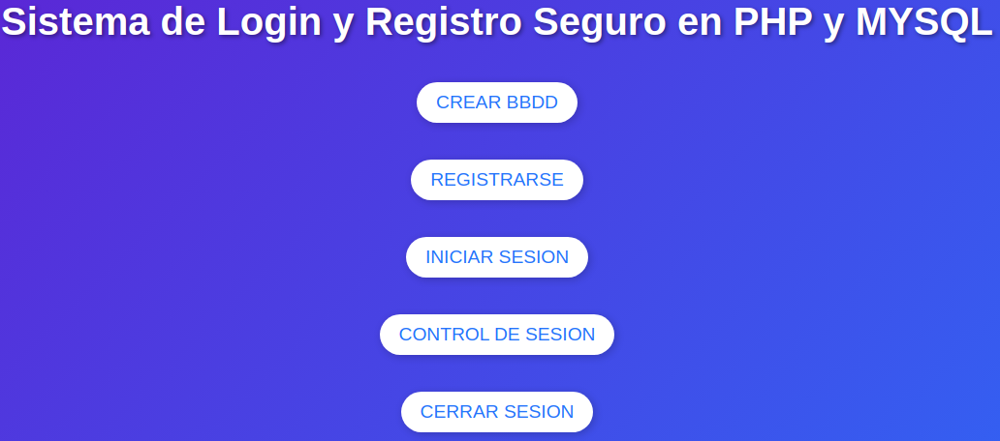
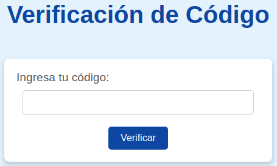
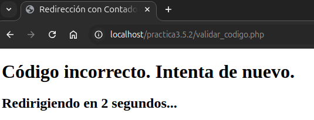
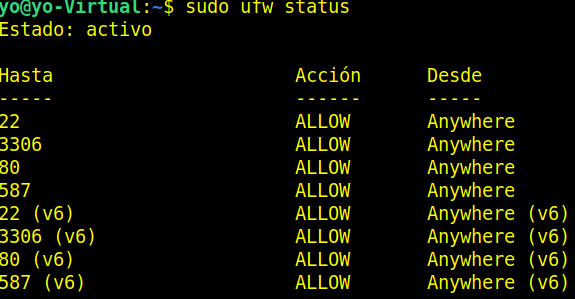

# Práctica 3.5.2: Práctica Final PHP CON 2FA

**Detallaremos documentalmente solo la parte correspondiente a la verificación del doble factor (2FA) que implantaremos en el registro del usuario, ya que el resto es igual a la Práctica 3.5.1.**
**Este proyecto (Práctica 3.5.2) contará en su carpeta con todos los archivos.**

## 1.-Formulario .html para el menú

**Podemos ver el fichero.css [aquí](style_css.md)**

**[Descargar el archivo](style.css.zip)**

**Podemos ver el fichero.html [aquí](operacionesBBDD_html.md)**

**[Descargar el archivo](operacionesBBDD.html.zip)**



### 2.-Formulario para enviar el código de verificación 2FA

**Creamos un formulario para que el usuario se pueda enviar el email.**

**Podemos ver el fichero.css [aquí](estilo2FA_css.md)**

**[Descargar el archivo](estilo2FA.css.zip)**

**Podemos ver el fichero.html [aquí](inicio_html.md)**

**[Descargar el archivo](inicio.html.zip)**


### 3.-Fichero script .php para enviar el código de verificación

**Podemos ver el fichero.php [aquí](enviar_correo_php.md)**

**[Descargar el archivo](enviar_correo.php)**

**Comprobamos que el email se ha recibido correctamente.**


### 4.-Formulario para introducir el código que nos han enviado por correo

**Podemos ver el fichero.css [aquí](verificar_css.md)**

**[Descargar el archivo](verificar.css.zip)**

**Podemos ver el fichero.html [aquí](verificar_html.md)**

**[Descargar el archivo](verificar.html.zip)**



### 5.-Fichero script .php para verificar el código introducido

**Podemos ver el fichero.php [aquí](validar_codigo_php.md)**

**[Descargar el archivo](validar_codigo.php)**


### ** El resto del proceso es igual que la Práctica 3.5.1 *

**Si no introducimos el código bien.**




---

## Configuración de Postfix

### 1.-Instalamos Postfix

`sudo apt update`

`sudo apt install postfix -y`

`sudo apt install libsasl2-modules`

#### 2.-Editamos el archivo de configuración de Postfix

`sudo nano /etc/postfix/main.cf`

**Añadimos las siguientes líneas:**

```text
# Configuración básica de Postfix
myhostname = localhost
mydestination = $myhostname, yo-Virtual, localhost.localdomain, , localhost

# Configuración del relay SMTP para GMail
relayhost = [smtp.gmail.com]:587
smtp_sasl_auth_enable = yes
smtp_sasl_password_maps = hash:/etc/postfix/sasl_passwd
smtp_sasl_security_options = noanonymous
smtp_use_tls = yes
smtp_tls_security_level = encrypt
smtp_tls_CAfile = /etc/ssl/certs/ca-certificates.crt

# Forzar uso de IPv4 (opcional si tienes problemas con IPv6)
inet_protocols = ipv4
```


#### 3.-Habilitaremos la contraseña de aplicación en GMail

**Por razones de seguridad, GMail no permite que aplicaciones menos seguras usen tu contraseña principal. Debemos hacer que se nos genere una contraseña de aplicación si la autenticación de dos factores está habilitada en nuestra cuenta.**

**Google bloquea aplicaciones menos seguras: Si no estás usando la autenticación en dos pasos, GMail puede bloquear el acceso de `postfix` por considerarlo una aplicación menos segura.**


* **1 Iniciaremos sesión en nuestra cuenta de GMail.**
* **2 Iremos a `Seguridad` en la configuración de nuestra cuenta.**


* **3 Buscaremos la sección `Contraseñas de aplicaciones`.**


  
  

* **4 Se genera una contraseña de aplicación para `postfix` y la usaremos en el archivo `/etc/postfix/sasl_passwd`.**

#### 4.-Configuramos las credenciales de GMail

**Creamos el archivo `/etc/postfix/sasl_passwd`para almacenar las credenciales.**

`sudo nano /etc/postfix/sasl_passwd`

**Añadiremos la siguiente línea, reemplazando `email` y `tu_contraseña` con tus credenciales que se me han generado al registrar la aplicación de `postfix` en mi GMail**

`[smtp.gmail.com]:587 udexeraco@gmail.com:tu_contraseña_de_aplicación
`


#### 5.-Proteger el archivo de credenciales

**Cambiamos los permisos para que solo el usuario root pueda leerlo:**

`sudo chmod 600 /etc/postfix/sasl_passwd`

#### 6.-Creamos el mapa hash para Postfix, generando un archivo hash a partir de `sasl_passwd`

`sudo postmap /etc/postfix/sasl_passwd`

`cd /etc/postfix`

`ls -la`


**Reiniciamos postfix:**

`sudo systemctl restart postfix`

**Comprobamos que tenemos habilitado el puerto 587 en el firewall.**

`sudo ufw status`



#### 7.-Verificamos la configuración de `Sendmail` en PHP

**PHP utiliza Sendmail (o un equivalente) para enviar correos. Debemos asegurarnos de que PHP esté correctamente configurado para usar Postfix.**

**Revisaremos nuestro archivo `php.ini` y nos aseguraremos de que la ruta a `sendmail` está correctamente configurada:**

**Ajustaremos según nuestra versión de PHP.**

`sudo nano /etc/php/8.3/apache2/php.ini`

**Buscaremos `sendmail_path` en `php.ini` y nos aseguraremos que tenga este valor:**

`sendmail_path = /usr/sbin/sendmail -t -i`


**Reiniciamos apache:**

`sudo systemctl restart apache2`

**Usamos el siguiente comando para enviar un correo de prueba:**

`echo "Correo de prueba desde Postfix usando Gmail" | mail -s "Prueba de Gmail" udexeraco@hotmail.com`

**Comprobamos su llegada:**


#### Conclusión

##### Diferencias entre mail() en PHP y el comando mail

Configuración de sendmail en PHP:

Cuando ejecutamos mail() en PHP, este utiliza la ruta de sendmail configurada en el archivo `php.ini`:

`sendmail_path = /usr/sbin/sendmail -t -i`

* Si esta configuración no es correcta, el correo no se enviará.

Mientras que, al usar el comando `mail` directamente en la terminal, estamos invocando a Postfix sin depender de la configuración de PHP.
