# Práctica 4.1 Tema WP desde cero

## Parte 1: Configuración del entorno

### 1.Descargamos e Instalamos WordPress con Docker

**En lugar de instalar WordPress manualmente, utilizaremos **Docker** para crear un entorno de desarrollo aislado.**

#### Paso 1: Instalamos Docker y Docker Compose

```bash
sudo apt update
sudo apt install docker.io docker-compose -y
```

#### Verificamos que Docker está instalado correctamente

```bash
docker --version
docker-compose --version
```

#### Paso 2: Creamos el Archivo `docker-compose.yml`

##### Navegamos a nuestro directorio de trabajo y creamos un archivo `docker-compose.yml`

```bash
mkdir ~/wordpress-docker
cd ~/wordpress-docker
nano docker-compose.yml
```

✍ **Contenido de `docker-compose.yml`:**

```yaml
version: '3.8'
services:
  wordpress:
    image: wordpress:latest
    container_name: mi-wordpress
    restart: always
    ports:
      - "8000:80"
    environment:
      WORDPRESS_DB_HOST: db
      WORDPRESS_DB_USER: root
      WORDPRESS_DB_PASSWORD: root
      WORDPRESS_DB_NAME: mi_wp
    volumes:
      - ./wp-content:/var/www/html/wp-content

  db:
    image: mysql:5.7
    container_name: mi-mysql
    restart: always
    environment:
      MYSQL_ROOT_PASSWORD: root
      MYSQL_DATABASE: mi_wp
    volumes:
      - db_data:/var/lib/mysql

volumes:
  db_data:
```

#### Paso 3: Iniciamos los Contenedores

##### Ejecutamos el siguiente comando en la terminal dentro del directorio donde hemos creado `docker-compose.yml`

```bash
docker-compose up -d
```

##### Esto nos descargará las imágenes necesarias y nos creará dos contenedores: uno para WordPress y otro para MySQL

#### Paso 4: Accedemos a WordPress

##### Abrimos un navegador y visitamos

```text
http://localhost:8000
```

##### Seguiremos el asistente de instalación de WordPress y usaremos estos datos

- **Base de datos:** `mi_wp`
- **Usuario:** `root`
- **Contraseña:** `root`
- **Host de la base de datos:** `db`

#### Paso 5: Accederemos a la Carpeta del Tema

##### El código del tema se guardará en la carpeta `wp-content` dentro de tu directorio `~/wordpress-docker/wp-content/`. Ahora puedes continuar con la creación del tema de WordPress dentro de esta carpeta

```text
~/wordpress-docker/wp-content/themes/mi-tema-personalizado/
```

#### Paso 6: Abriremos el Proyecto en VS Code

```bash
code ~/wordpress-docker/wp-content/themes/mi-tema-personalizado
```

---

## Parte 2: Creamos el Tema en WordPress

### Paso 1: Accedemos al contenedor de WordPress

#### 1.Listamos los contenedores en ejecución

   ```bash
   docker ps
   ```

##### En nuestro caso, el nombre del contenedor es `wordpress_wordpress_1`

#### 2. Accedemos al contenedor

##### Usamos el siguiente comando para acceder a una terminal dentro del contenedor

   ```bash
   docker exec -it wordpress_wordpress_1 /bin/bash
   ```

##### Esto nos dará acceso a la terminal del contenedor de WordPress

---

### Paso 2: Creamos la carpeta del tema

#### 1. Navegamos al directorio de temas

##### Dentro del contenedor, los temas de WordPress se almacenan en la ruta

   ```bash
   cd /var/www/html/wp-content/themes/
   ```

#### 2. Creamos una carpeta para nuestro tema

   ```bash
   mkdir temanuevo
   ```


#### 3. Creamos los archivos básicos del tema

##### Dentro de la carpeta `temanuevo`, necesitaremos crear al menos dos archivos para que WordPress reconozca el tema

- `style.css`: Define la información del tema.
  
- `index.php`: El archivo principal del tema.

   ```bash
   cd temanuevo
   touch style.css index.php
   ```


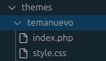

- **1. Editamos el archivo `style.css`**:
   **Abrimos el archivo `style.css` y agregamos  la información básica del tema. Por ejemplo:**

**Podemos ver el fichero.php [aquí](style_css.md)**

**[Descargar el archivo](style.css)**

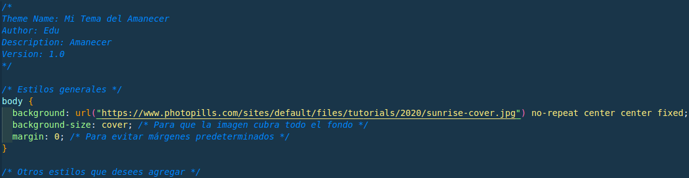

- **2. Editamos el archivo `index.php`**:

   **Abrimos el archivo `index.php` y agregamos con un código básico para WordPress:**

**Podemos ver el fichero.php [aquí](index_php.md)**

**[Descargar el archivo](index.php)**

### Paso 3: Activamos el tema en WordPress

1. **Salimos del contenedor**:
   Escribimos `exit` para salir de la terminal del contenedor.

2. **Accedemos a WordPress**:
   Abrimos nuestro navegador y vamos a `http://localhost:8000/wp-admin`.

3. **Activamos el tema**:
   - Vamos a **Apariencia > Temas**.
   - Debemos ver nuestro tema `Mi Tema del Amanecer` en la lista de temas disponibles.
   - Hacemos clic en **Activar** para usar nuestro tema personalizado.

4. **Verificamos**:
   - Accedemos al sitio web y comprobamos que el contenido del `index.php` se muestra correctamente.

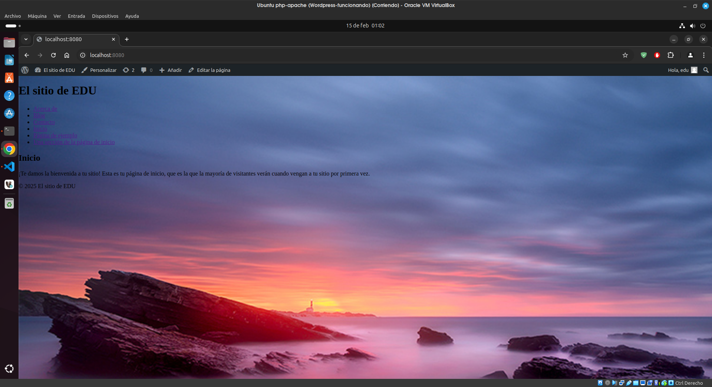

---

### Paso 4: Mejoramos el tema

#### 1.Creamos un archivo `screenshot.png`

##### Creamos una imagen de 1200x900 píxeles que represente una vista previa del diseño de nuestro tema

##### Guardaremos esta imagen como screenshot.png en la carpeta temanuevo

```bash
docker cp /home/yo/Escritorio/Comparte/screenshot.png wordpress-wordpress-1:/var/www/html/wp-content/themes/temanuevo
```

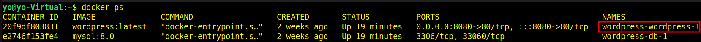


#### 2.Agregamos una hoja de estilos adicional `custom.css`

##### Creamos un nuevo archivo llamado custom.css en la carpeta temanuevo

`mkdir custom.css`


##### En este archivo, podemos agregar estilos personalizados para mejorar el diseño de tu tema

##### Vamos a modificar nuestro código para asegurarnos de que ambos archivos CSS (style.css y custom.css) se carguen correctamente

**Código actualizado:**

**Podemos ver el fichero.css [aquí](custom_css.md)**

**[Descargar el archivo](custom.css)**

#### 3.Para que WordPress cargamos este archivo, abrimos `index.php` y agregamos el siguiente código para cuando se carga style.css

```php
<link rel="stylesheet" href="<?php echo get_stylesheet_directory_uri(); ?>/style.css">
<link rel="stylesheet" href="<?php echo get_stylesheet_directory_uri(); ?>/custom.css">
```

##### Entendemos que nuestro archivo `PHP` ya tiene una estructura básica de un tema de WordPress, pero queremos asegurarnos de que se carguen correctamente tanto `style.css` como `custom.css`

##### Vamos a modificar tu código para asegurarnos de que ambos archivos CSS (`style.css` y `custom.css`) se carguen correctamente

**Código actualizado:**

**Podemos ver el fichero.php [aquí](index_modificado_php.md)**

**[Descargar el archivo](index_modificado.php)**

#### 4. Creamos archivos en la carpeta `parts/` para el encabezado y el pie de página

##### La carpeta parts/ nos permitirá organizar mejor nuestro código, separando el encabezado `header.php` y el pie de página `footer.php` en archivos independientes

**Pasos:**

**1.Creamos una carpeta llamada `parts` dentro de la carpeta `temanuevo`**


**2.Dentro de parts/, creamos dos archivos:**

- **`header.php`: Para el código del encabezado.**

- **`footer.php`: Para el código del pie de página.**


**3.Contenido de `header.php`:**

**Podemos ver el fichero.php [aquí](header_php.md)**

**[Descargar el archivo](header.php)**

**4. Contenido de `footer.php`:**

**Podemos ver el fichero.php [aquí](footer_php.md)**

**[Descargar el archivo](footer.php)**

**5. Añadimos `header.php` y `footer.php` en el fichero `index.php`:**
**Modifica tu archivo index.php para incluir estos archivos usando la función `get_template_part()` de WordPress:**

`<?php get_template_part('parts/footer'); ?>`


##### Estructura final del tema

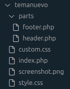


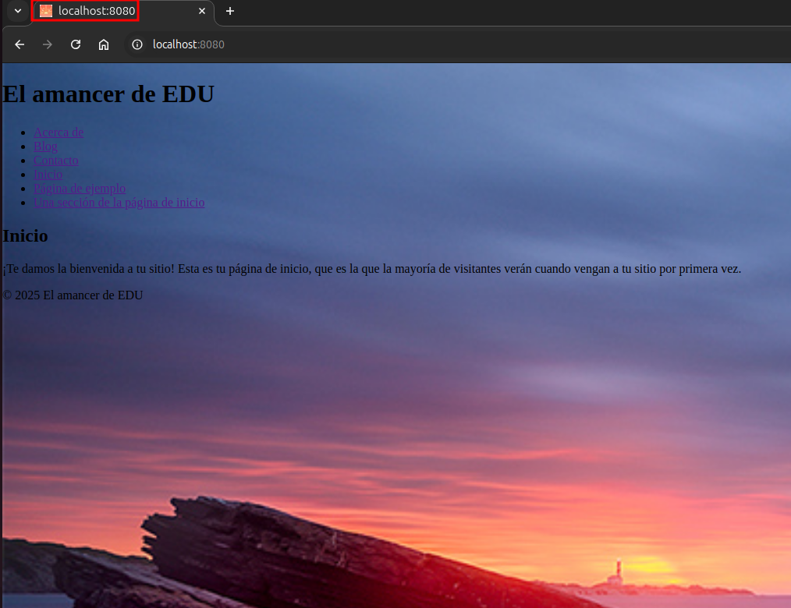

### 5. Desafío extra

#### Crearemos un tema hijo basado en otro tema existente

#### 1. Nos vamos a Plugins>>añadir un nuevo plugin


##### 2. En el buscador ponemos la palabra `child theme`, seleccionamos el que más nos guste, le damos a `instalar` y finalmente a `activar`

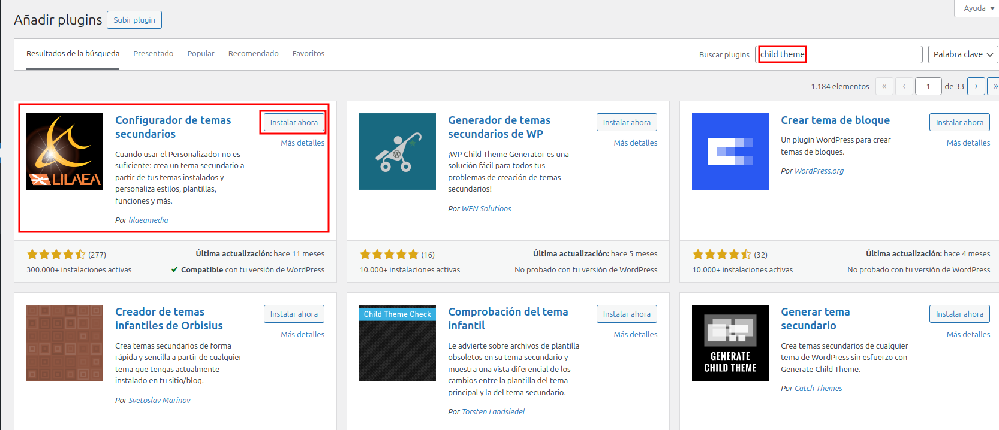

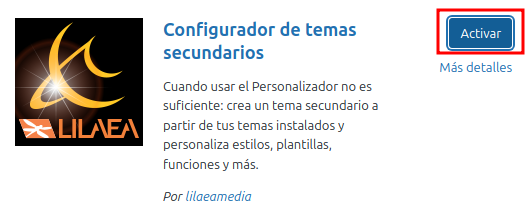

##### 3. Verificamos que lo tenemos instalado y en Herramientas>>Temas hijo


##### 4. Analizamos el tema padre

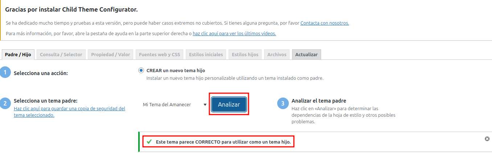

##### 5. Normalmente no vamos a tocar `NADA` y le damos a `Create New Child Theme` en la parte inferior de esta sección

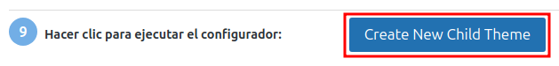


##### 6. Hora solo nos falta `activarlo` en Apariencia>>Temas


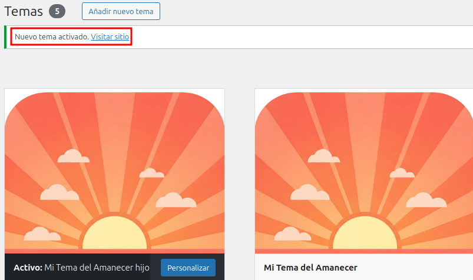


##### Vemos la estructura de directorios y ficheros creada

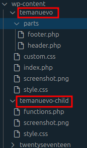
