# Instalar Wordpress

## Instalamos WordPress con LAMP en Ubuntu 24.04.4

### 1.-Actualizamos los paquetes del sistema

`sudo apt update`
`sudo apt dist-upgrade y`
`sudo apt autoremove -y`

### 2.-Instalamos apache

`sudo apt install apache2 -y`

### 3.-Instalamos Mysql-server

`sudo apt install mysql-server -y`

### 4.-Instalamos PHP y las extensiones necesarias

`sudo apt install php php-mysql php-xml php-curl php-gd php-cli php-zip libapache2-mod-php -y`

## Configuramos la BBBDD para WordPress

### 1.-accedemos a Mysql

`sudo mysql -u root`

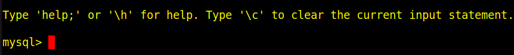

### 2.-Creamos las BBDD, permisos y el usuario para WordPress

`CREATE DATABASE nombre-bbdd;`
`CREATE USER 'usuario-wordpress'@'localhost' IDENTIFIED BY 'contraseña';`
`GRANT ALL PRIVILEGES ON nombre-bbdd.* TO 'usuario-wordpress'@'localhost';`
`FLUSH PRIVILEGES;`
`EXIT;`

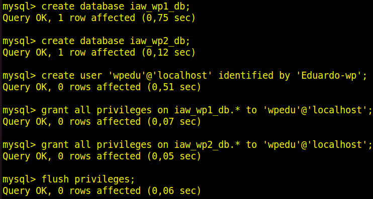

## Sitio "Wordpress 1" que instalamos con apt install

### 1.-Descargamos Wordpress

Navegamos al directorio de la descarga por defecto de apt **(/usr/share)**

`cd /usr/share`
`sudo apt install worpress -y`
`sudo chown -R www-data:www-data /usr/share/wordpress`
`sudo chmod -R 755 /usr/share/wordpress`

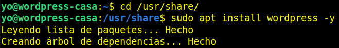

### 2.-Configuramos apache para Wordpress 1

Creamos un archivo de configuración para WordPress en Apache:

`sudo nano /etc/apache2/sites-available/wordpress1.conf`

Agregamos las siguientes líneas al fichero **(por el puerto 8888)**

```html
<VirtualHost *:8888>
    ServerAdmin tu_email@example.com
    DocumentRoot /usr/share/wordpress
    ServerName tu_dominio_o_IP

    <Directory /usr/share/wordpress>
        Options Indexes FollowSymLinks
        AllowOverride All
        Require all granted
    </Directory>

    ErrorLog ${APACHE_LOG_DIR}/wordpress_error.log
    CustomLog ${APACHE_LOG_DIR}/wordpress_access.log combined
</VirtualHost>
```

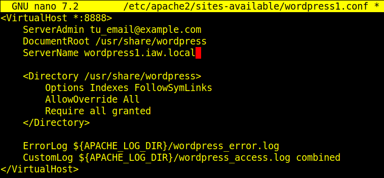

Habilitamos la configuración del sitio y los módulos necesarios

`sudo a2ensite wordpress1.conf`
`sudo systemctl reload apache2.service`
`sudo a2enmod rewrite`
`sudo systemctl restart apache2.service`

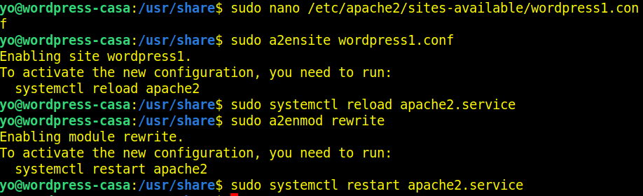

## Configuramos WordPress 1

### 1.-Configuramos el fichero wp-config.php

Copiamos el archivo de configuración de muestra:

`cd /usr/share/wordpress`
`sudo cp wp-config-sample.php wp-config.php`

Editamos el archivo **wp-config.php**

`sudo nano wp-config.php`

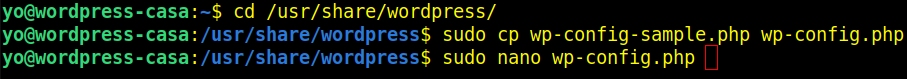

Modificamos las siguientes líneas con los datos de tu base de datos:

```php
define('DB_NAME', 'wordpress_db');
define('DB_USER', 'wordpress_user');
define('DB_PASSWORD', 'tu_contraseña_segura');
define('DB_HOST', 'localhost');
```

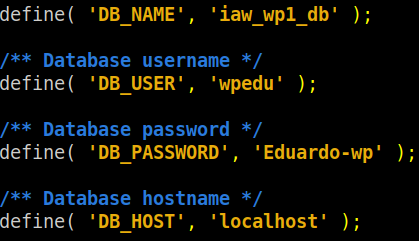

`sudo systemctl restart apache2.service`

### 2.- Habilitamos el puerto 8888

`sudo nano /etc/apache2/ports.conf`


`sudo systemctl restart apache2.service`

### 3.- Habilitamos el dominio en el fichero /etc/hosts

`sudo nano /etc/hosts`

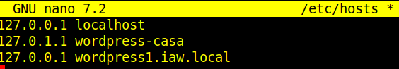

`sudo systemctl restart apache2.service`

### 4.- Completamos la instalación a través del navegador

Abre a nuestro navegador web y accedemos a **http://tu_dominio_o_IP/wordpress**. Seguimos las instrucciones del instalador de WordPress:

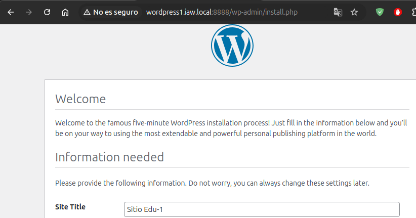
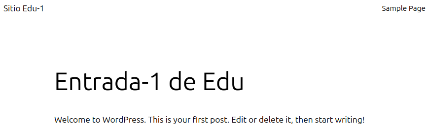

## Sitio "Wordpress 2" que instalamos con la última versión

### 1.- Descargamos Wordpress

Navegamos al directorio de Apache y descargamos WordPress:

`cd /var/www/html`
`sudo wget https://wordpress.org/latest.tar.gz`
`sudo tar -xzvf latest.tar.gz`
`sudo rm latest.tar.gz`
`sudo chown -R www-data:www-data /var/www/html/wordpress`
`sudo chmod -R 755 /var/www/html/wordpress`

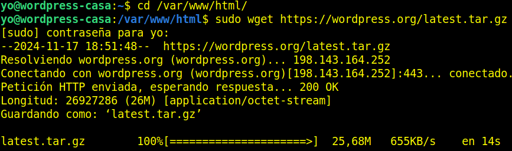

### 2.- Configuramos apache para Wordpress 2

Creamos un archivo de configuración para WordPress en Apache:

`sudo nano /etc/apache2/sites-available/wordpress2.conf`

Agregamos las siguientes líneas al fichero **(por el puerto 9999)**

```html
<VirtualHost *:9999>
    ServerAdmin tu_email@example.com
    DocumentRoot /var/www/html/wordpress
    ServerName tu_dominio_o_IP

    <Directory /var/www/html/wordpress>
        Options Indexes FollowSymLinks
        AllowOverride All
        Require all granted
    </Directory>

    ErrorLog ${APACHE_LOG_DIR}/wordpress_error.log
    CustomLog ${APACHE_LOG_DIR}/wordpress_access.log combined
</VirtualHost>
```

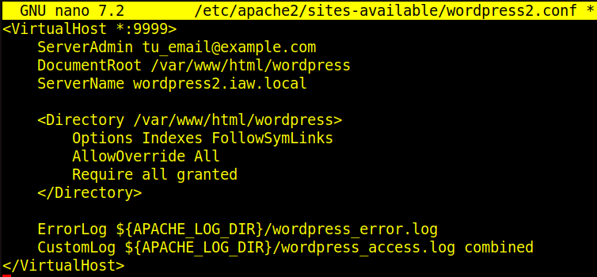

Habilitamos la configuración del sitio y los módulos necesarios

`sudo a2ensite wordpress2.conf`
`sudo systemctl reload apache2.service`
`sudo a2enmod rewrite`
`sudo systemctl restart apache2.service`

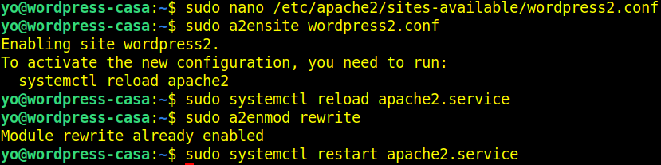

## Configuramos WordPress 2

### 1.- Configuramos el fichero wp-config.php

Copiamos el archivo de configuración de muestra:

`cd /var/www/html/wordpress`
`sudo cp wp-config-sample.php wp-config.php`

Editamos el archivo **wp-config.php**

`sudo nano wp-config.php`

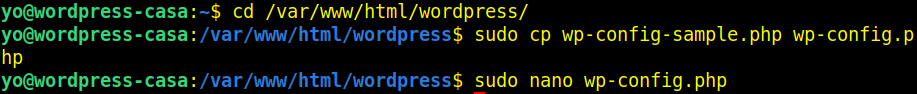

Modificamos las siguientes líneas con los datos de tu base de datos:

```php
define('DB_NAME', 'wordpress_db');
define('DB_USER', 'wordpress_user');
define('DB_PASSWORD', 'tu_contraseña_segura');
define('DB_HOST', 'localhost');
```

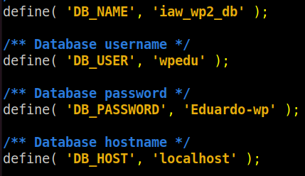

`sudo systemctl restart apache2.service`

### 2.- Habilitamos el puerto 9999

`sudo nano /etc/apache2/ports.conf`


`sudo systemctl restart apache2.service`

### 3.-Habilitamos el dominio en el fichero /etc/hosts

`sudo nano /etc/hosts`

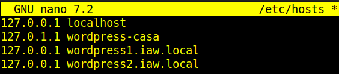

`sudo systemctl restart apache2.service`

### 4.-Completamos la instalación a través del navegador

Abre a nuestro navegador web y accedemos a **http://tu_dominio_o_IP/wordpress**. Seguimos las instrucciones del instalador de WordPress:

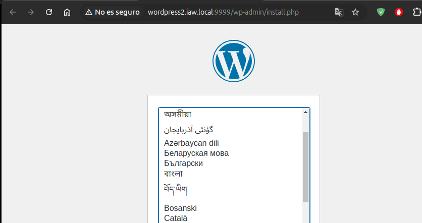
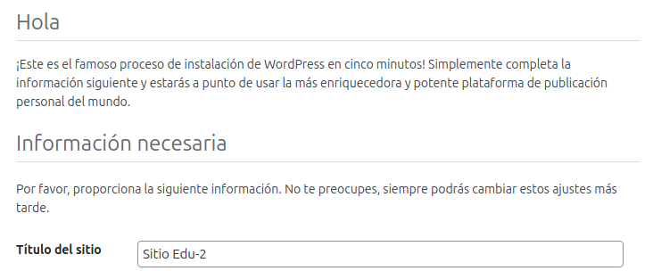
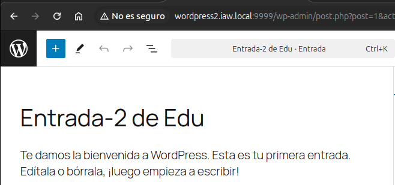

## Configuramos el balanceador de carga

### 1.-Instalamos los módulos necesarios

`sudo a2enmod proxy`
`sudo a2enmod ssl`
`sudo a2enmod proxy_balancer`
`sudo a2enmod proxy_http`
`sudo a2enmod lbmethod_byrequests`
`sudo systemctl restart apache2`

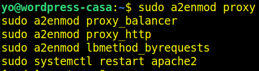

### 2.-Utilizamos un certificado autofirmado

Ejecutamos el script para este cometido:

`./setup-certificado-firmado.sh`

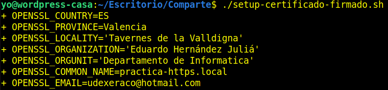


### 3.-Configuramos Apache para el balanceador

Creamos un archivo de configuración para WordPress en Apache:

`sudo nano /etc/apache2/sites-available/wordbalan-ssl.conf`

Agregamos las siguientes líneas al fichero **(por el puerto 443)**

```html
<VirtualHost *:443>
    ServerName nombre-de dominio.com

    SSLEngine on
    SSLCertificateFile /etc/ssl/certs/apache-selfsigned.crt
    SSLCertificateKeyFile /etc/ssl/private/apache-selfsigned.key

    # Configuración del balanceador
    <Proxy "balancer://mycluster">
        # Usa Round Robin (predeterminado)
        BalancerMember http://nombre-de-domino.local:puerto
        BalancerMember http://nombre-de-dominio.local:puerto
        ProxySet lbmethod=byrequests
    </Proxy>

    ProxyPass / balancer://mycluster/
    ProxyPassReverse / balancer://mycluster/

    ErrorLog ${APACHE_LOG_DIR}/balancer_error.log
    CustomLog ${APACHE_LOG_DIR}/balancer_access.log combined
</VirtualHost>
```

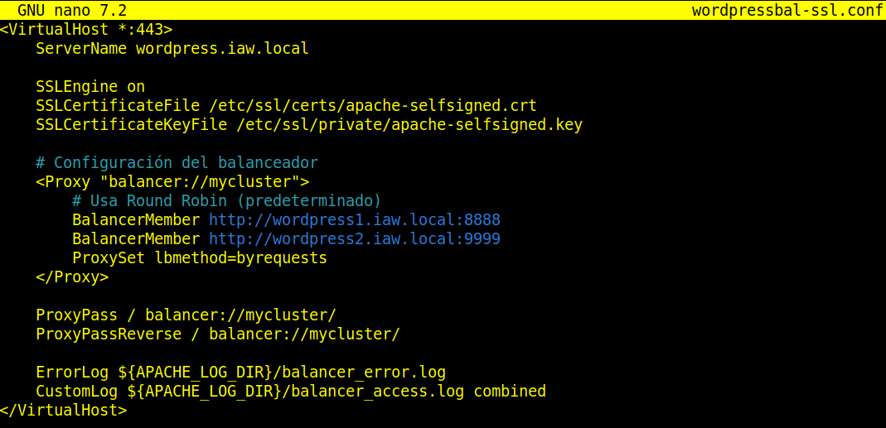

`sudo systemctl restart apache2`
`sudo systemctl status apache2`

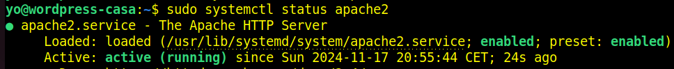

### 4.-Habilitamos en el fichero /etc/hosts

`sudo nano /etc/hosts`

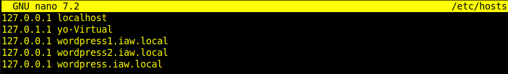

`sudo systemctl restart apache2`

### 5.-Comprobamos a través del navegador el funcionamiento del balanceador

Abre a nuestro navegador web y accedemos a **http://tu_dominio_o_IP/wordpress**. Seguimos las instrucciones del instalador de WordPress:

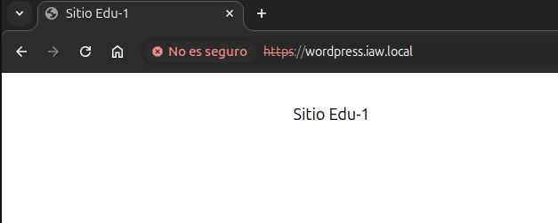
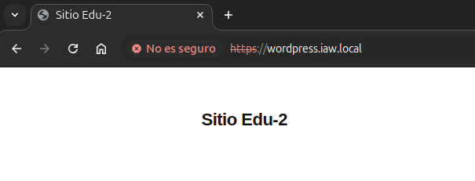
