# Examen_UD4_PHP

## Creación de un Acortador de URLs con PHP

### 1.-Formulario .html para el menú

**Podemos ver el fichero.html [aquí](menu_html.md)**

**[Descargar el archivo](menu.html.zip)**

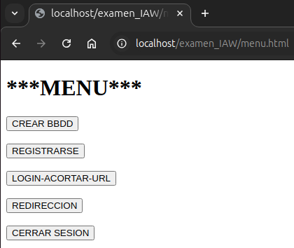

### 2.-Fichero script .php para la creación de la BBDD y tablas

**Podemos ver el fichero.php [aquí](crearBBDD_php.md)**

**[Descargar el archivo](crearBBDD.php)**

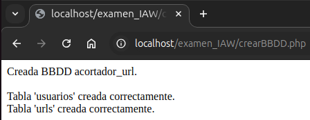

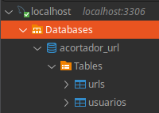

**Si intentamos volver a crear la tabla no se realizará nada.**

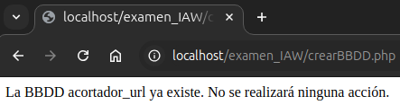

### 3.-Formulario para registrarse "insertar" registros

**Podemos ver el fichero.html [aquí](registro_html.md)**

**[Descargar el archivo](registro.html.zip)**

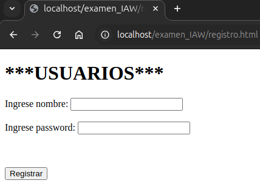

### 4.-Fichero script .php para registrarse

**Podemos ver el fichero.php [aquí](registro_php.md)**

**[Descargar el archivo](registro.php)**

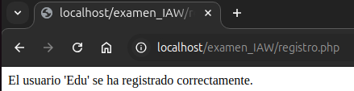

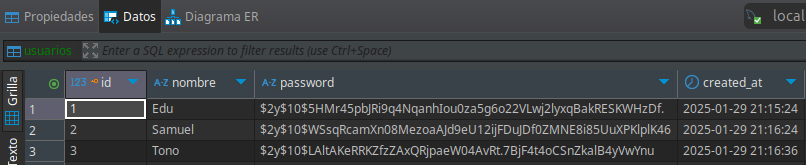

### 5.-Formulario para hacer "login"

**Podemos ver el fichero.html [aquí](login_html.md)**

**[Descargar el archivo](login.html.zip)**

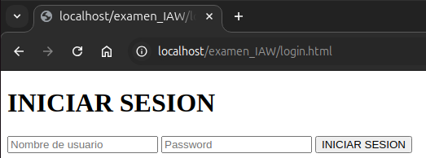

### 6.-Fichero script .php para iniciar el login de sesión

**Podemos ver el fichero.php [aquí](login_php.md)**

**[Descargar el archivo](login.php)**

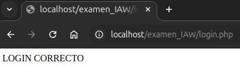

### 7.-Formulario para "Acortar URL"

**Podemos ver el fichero.html [aquí](acortar_html.md)**

**[Descargar el archivo](acortar.html.zip)**

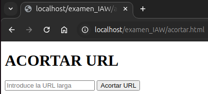

<https://aws.amazon.com/ec2/instance-types/t4/?cards-all.sort-by=item.additionalFields.sortDate&cards-all.sort-order=asc>

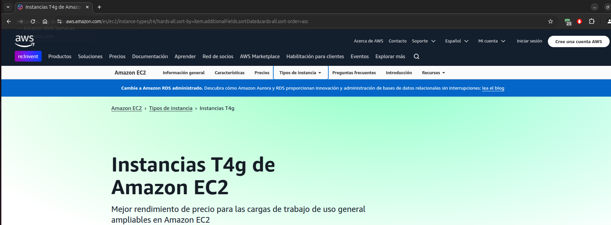

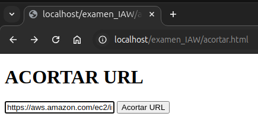

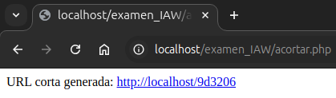

### 8.-Fichero script .php para acortar la URL larga

**Grabación del registro en la tabla urls.**

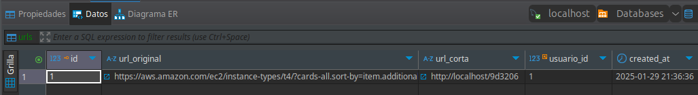

**Podemos ver el fichero.php [aquí](acortar_php.md)**

**[Descargar el archivo](acortar.php)**

### 9.-Fichero script .php para solicitar la URL corta

**Podemos ver el fichero.php [aquí](redirect1_php.md)**

**[Descargar el archivo](redirect1.php)**

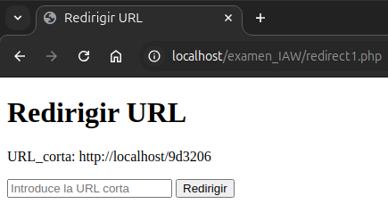

### 10.-Fichero script .php para redireccionar la URL corta

**Podemos ver el fichero.php [aquí](redirect2_php.md)**

**[Descargar el archivo](redirect2.php)**

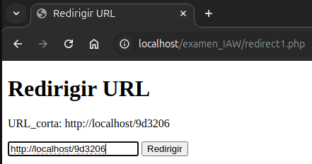

**Nos redirige a la URL larga introducida en un principio.**

### 11.-Fichero script .php para "cerrar sesión" que nos redirige a la página de "Google"

**Podemos ver el fichero.php [aquí](logout_php.md)**

**[Descargar el archivo](logout.php)**

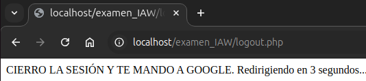

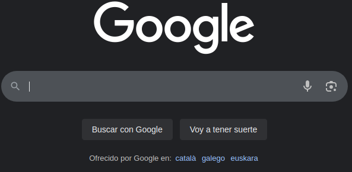

### 12.-Fichero script .php para la función de "conexión"

**Podemos ver el fichero.php [aquí](conexion_php.md)**

**[Descargar el archivo](conexion.php)**
